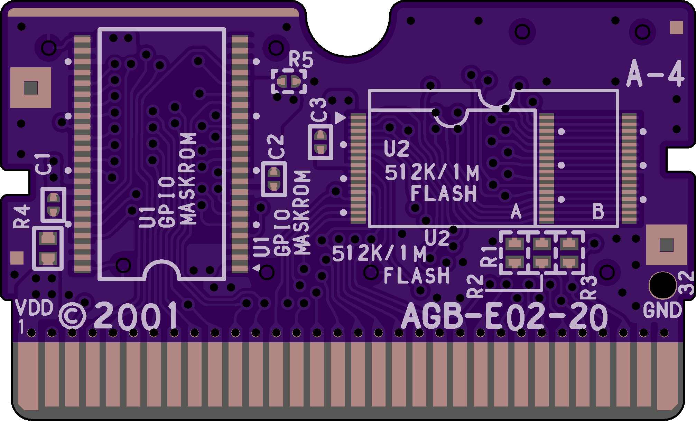

# AGB-E02-20

Intended as a replacement for Games like Fire Red & Leaf Green

## BOM
| **Designator** | **Part**                              |
|----------------|---------------------------------------|
| U1             | MX23L12806-12C (Must to be harvested) |
| U2             | LE26FV10N1TS (Must to be harvested)   |
| C1,C2,C3       | 0.1uF(100nF) 0402 6.3V (or higher voltage)    |
| R1,R2,R3       | Unpopulated                           |
| R4             | 2.2uF 0603                            |
| R5             | Unpopulated                           |

### Images

