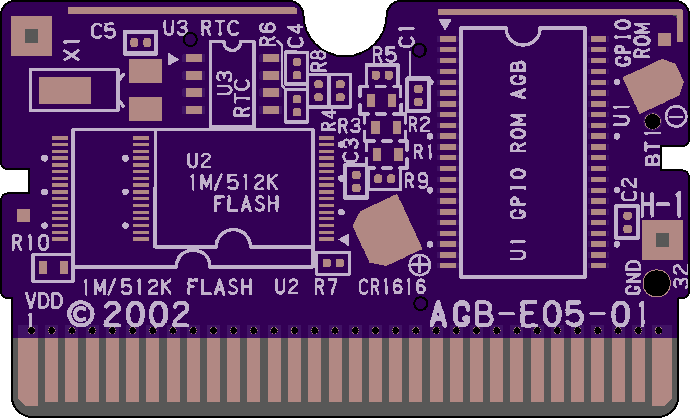

# AGB-E05-01

Intended as a replacement for Games like Fire Red & Leaf Green

## BOM
| **Designator** | **Part**                              |
|:-----------:|:-------------------------------------------------------------:|
| C1,C2,C3,C4 |                           100nF 0402                          |
|          C5 |            4pF or 10pF 0402 (depends on the board)            |
|    R1,R2,R3 |                          Unpopulated                          |
|    R4,R5,R6 |                            10K 0402                           |
|       R6,R7 |                           100K 0402                           |
|          R8 |                            1K 0402                            |
| R10         | 2K Resistor 0603 or 1uF Capacitor 0603 (depends on the board) |

### Images

